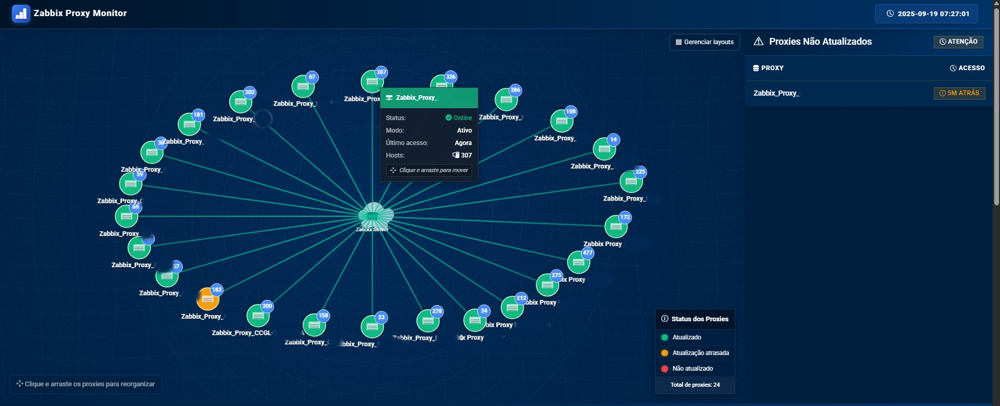

# Zabbix Proxy Dashboard

Dashboard para monitoramento de proxies do Zabbix.



Um dashboard moderno e interativo para monitoramento de proxies do Zabbix, oferecendo visualização em tempo real do status dos proxies, dados estatísticos e gerenciamento de layouts personalizados.


## Configuração para Produção

### Pré-requisitos
- Python 3.9 ou superior
- Acesso a um servidor Zabbix

### Instalação

1. Clone o repositório:
```
git clone https://github.com/SchiavonNathan/zabbix-proxy-monitor.git
cd zabbix-proxy-monitor
```

2. Crie um ambiente virtual e ative-o:

**Windows**:
```
python -m venv venv
venv\Scripts\activate
```

**Linux/macOS**:
```
python3 -m venv venv
source venv/bin/activate
```

3. Instale as dependências:
```
pip install -r requirements.txt
```

4. Configure o arquivo `.env`:
Copie o arquivo `.envexample` para `.env` e preencha as variáveis:
```
cp .envexample .env
```
Edite o arquivo `.env` com suas credenciais do Zabbix e outras configurações.

### Execução em Produção

#### No Windows:

1. Execute o script de produção:
```
.\start_prod.ps1
```

Ou manualmente:
```
$env:FLASK_ENV = "production"
python -m waitress --port=5001 wsgi:app
```

#### No Linux/Unix:

1. Execute o script de produção:
```
chmod +x start_prod.sh
./start_prod.sh
```

Ou manualmente:
```
export FLASK_ENV="production"
gunicorn --config gunicorn_config.py wsgi:app
```

### Configuração como Serviço no Linux

1. Copie o arquivo de serviço para a pasta do systemd:
```
sudo cp zabbix-dashboard.service /etc/systemd/system/
```

2. Ajuste o caminho no arquivo de serviço para corresponder à sua instalação.

3. Inicie e habilite o serviço:
```
sudo systemctl daemon-reload
sudo systemctl start zabbix-dashboard
sudo systemctl enable zabbix-dashboard
```

## Execução com Docker Compose

### Pré-requisitos
- Docker
- Docker Compose

### Passos para execução

1. Certifique-se de ter um arquivo `.env` configurado corretamente com suas credenciais do Zabbix:
```
cp .envexample .env
```

2. Edite o arquivo `.env` com suas configurações:
```
ZABBIX_SERVER=https://seu-servidor-zabbix.com
ZABBIX_USER=seu_usuario
ZABBIX_PASSWORD=sua_senha
FLASK_SECRET_KEY=uma_chave_secreta_aleatoria
```

3. Execute o Docker Compose:
```
docker-compose up -d
```

4. Acesse o dashboard em seu navegador:
```
http://localhost:5001
```

### Gerenciamento do Docker

- Verificar logs do contêiner:
```
docker-compose logs -f
```

- Parar os contêineres:
```
docker-compose down
```

- Reiniciar após alterações:
```
docker-compose up -d --build
```

## Funcionalidades Principais

- **Visualização em Tempo Real**: Monitoramento do status de todos os proxies conectados
- **Mapa de Rede Interativo**: Visualização gráfica dos proxies com status por cores
- **Layouts Personalizáveis**: Salve e carregue diferentes organizações de layout
- **Gráficos de Performance**: Visualize o desempenho histórico dos proxies
- **Responsivo**: Interface adaptável a diferentes tamanhos de tela
```
